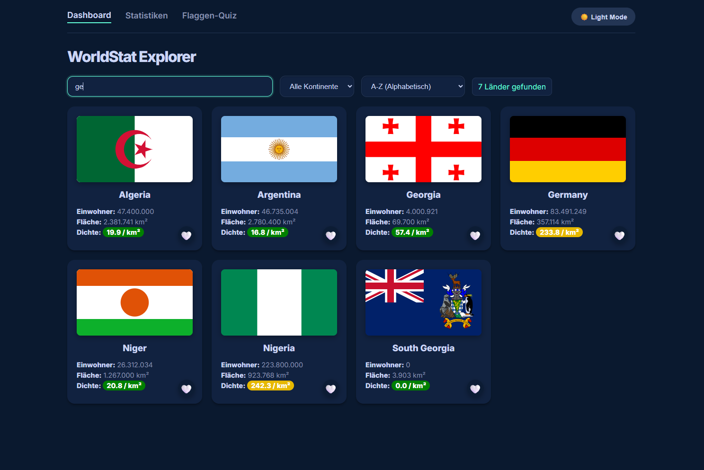
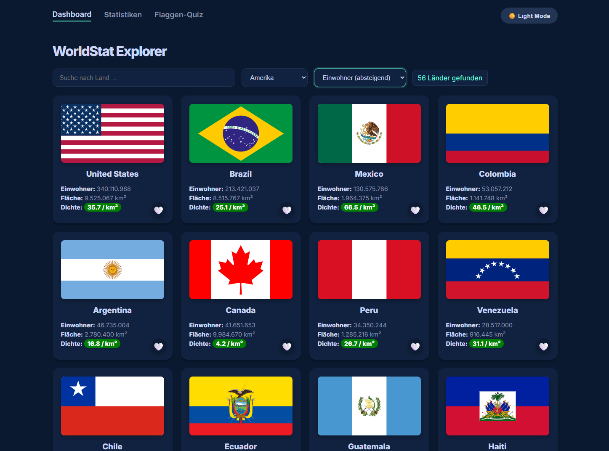
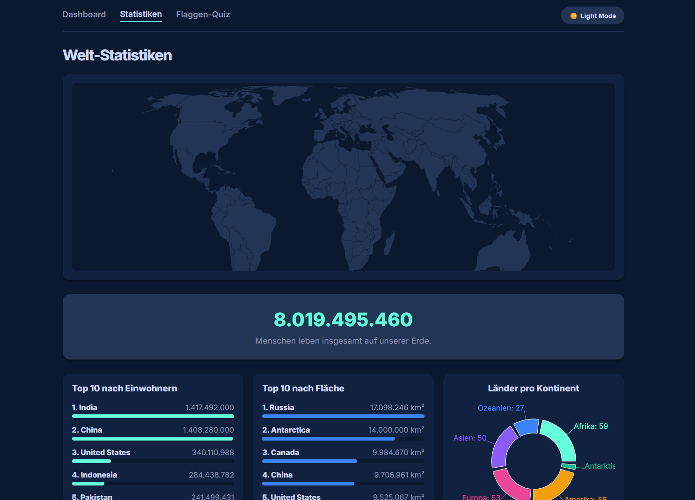
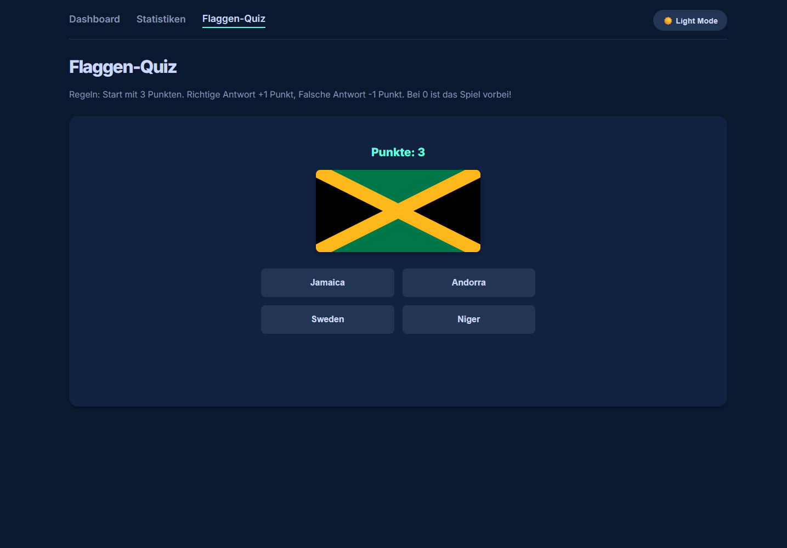
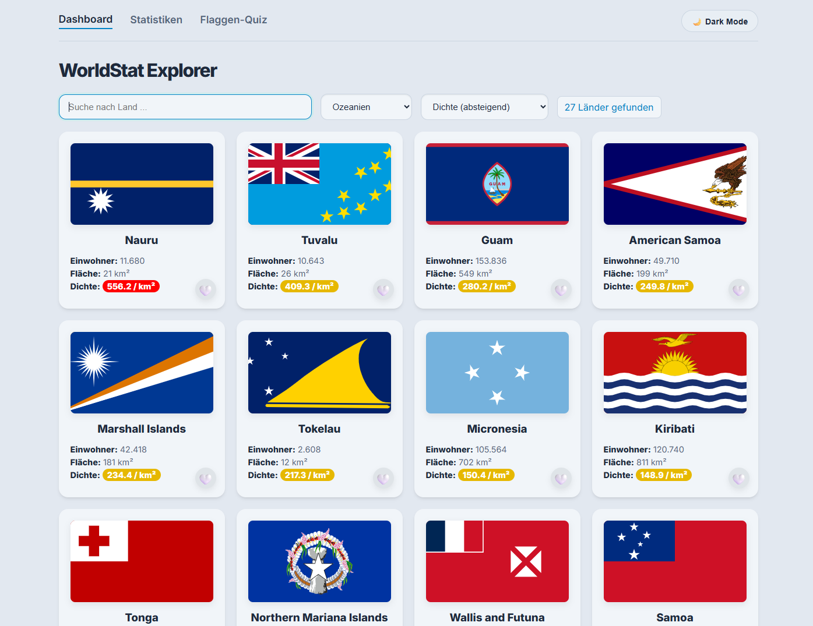
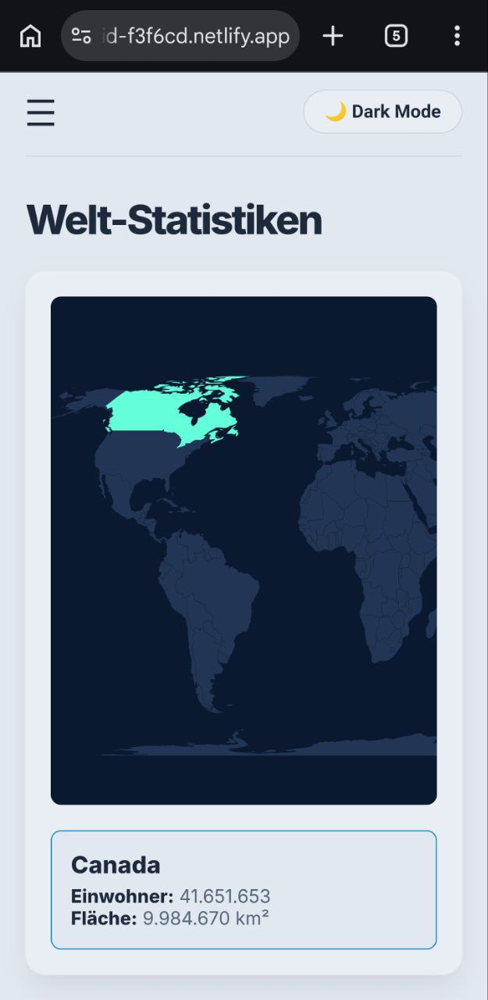
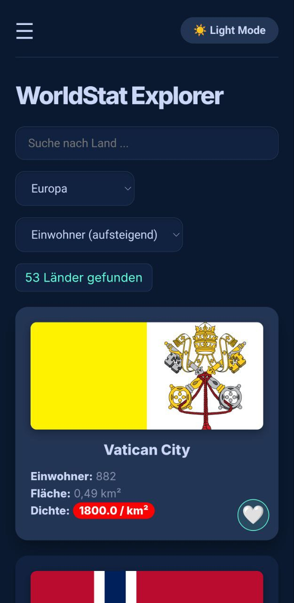

# WorldStat Explorer: Global Data & Statistics

Eine interaktive, performante React-Single-Page-Application zur Erkundung globaler Länderdaten, Statistiken und Flaggen. Der Fokus lag auf sauberem State-Management, asynchronem Data-Fetching und einer responsiven UI.

 
   
  
  
  
  
  
  

## Tech Stack

Dieses Projekt wurde komplett als moderne Frontend-App umgesetzt:

* **Frontend:** React.js, Gatsby
* **Styling:** Vanilla CSS
* **APIs:** REST Countries API
* **Libraries:** `recharts` (Datenvisualisierung), `react-simple-maps` (Interaktive Weltkarte)

## Features

* **Echtzeit-Daten:** Anbindung an die *REST Countries API* für immer aktuelle globale Daten.
* **Filter:** Such- und Filterfunktionen (nach Regionen) in Echtzeit sowie Multi-Kriterien-Sortierung (Fläche, Einwohner, Dichte).
* **Performance:** Implementierung von **Infinite Scrolling**, um Ladezeiten bei großen Datenmengen zu minimieren.
* **Datenvisualisierung:** Interaktive Weltkarte (`react-simple-maps`) und anschauliche Torten-/Balkendiagramme (`recharts`).
* **Gamification:** Ein integriertes Flaggen-Quiz mit dynamischem Punkte-System.
* **UX / UI:** Lokaler Dark/Light-Mode Toggle (`localStorage`), vollständig responsives Design (inkl. Hamburger-Menü) und ein interaktives Favoriten-System.

